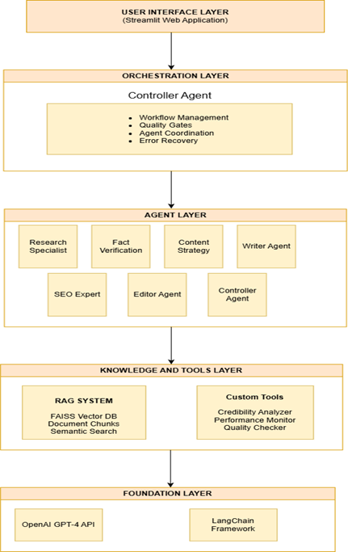
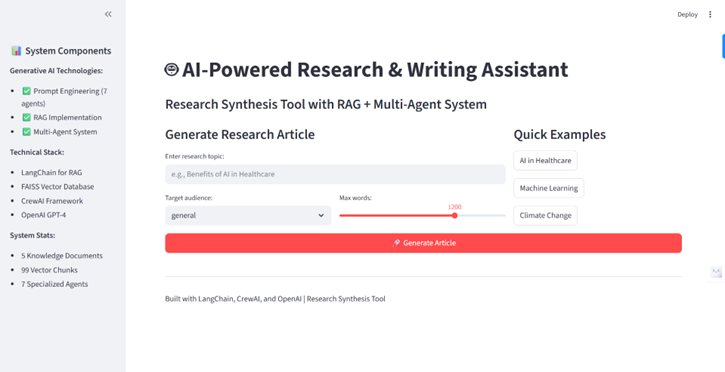
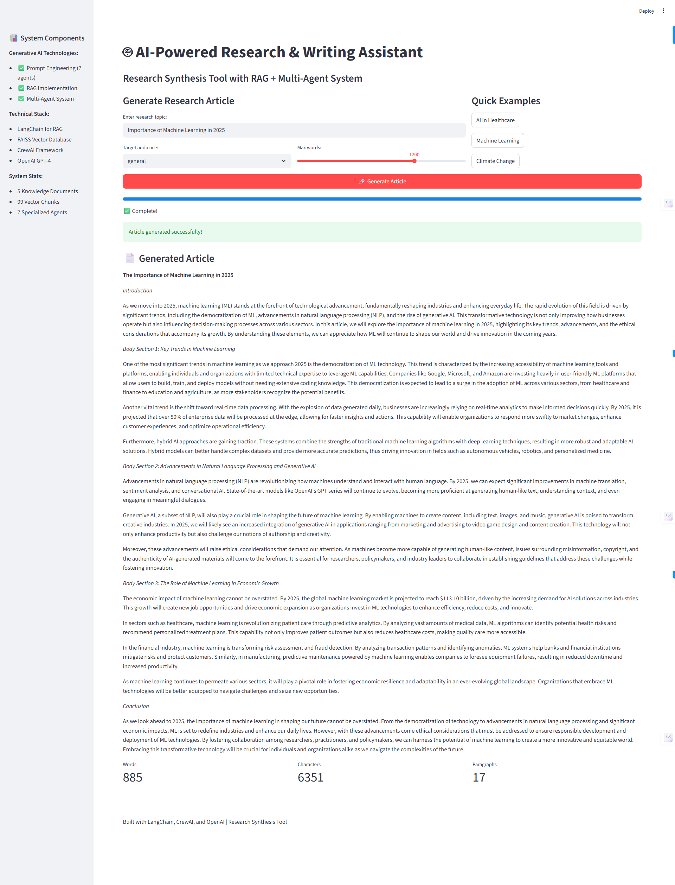

# 🤖 AI-Powered Research & Writing Assistant

A production-style research synthesis system built with Retrieval-Augmented
Generation (RAG) and multi-agent orchestration. Decomposes complex research
tasks into structured subtasks handled by specialized AI agents, producing
high-quality, fact-checked, publication-ready articles.



## ✨ Features
- 7 specialized AI agents (Research, Fact Verification, Strategy, Writing, SEO, Editorial, Controller)
- RAG pipeline using FAISS vector database with semantic search
- Multi-agent orchestration via CrewAI
- Interactive Streamlit web interface
- CLI support for automation
- 134 semantic vector chunks across 7 curated knowledge documents

## 🧠 Architecture
The system is structured into a modular 4-layer architecture ensuring robust data flow and separation of concerns:
1. **User Interface (UI) Layer**: An interactive Streamlit dashboard (`app.py`) allowing users to input research topics, select target audiences (general, technical, academic), and adjust word limits. It queries system files dynamically to display live database and agent statistics.
2. **Orchestration Layer**: Orchestrated by `EnhancedOrchestrator` (`src/orchestrator_enhanced.py`) or `ResearchWritingOrchestrator` (`src/orchestrator.py`). The orchestrator coordinates workflow execution, runs sanity checks, integrates custom tools, and queries the RAG system to pass relevant background context to downstream agents.
3. **Agent Layer**: Built on top of the CrewAI framework (`src/agents.py` and `src/tasks.py`), configuring and instantiating specialized AI agents. Each agent acts under target LLM parameters, distinct persona instructions, and custom tools.
4. **Knowledge & RAG Layer**: A LangChain-driven semantic search pipeline backed by a FAISS vector database (`src/rag_system.py`). Local text resources under `knowledge_base/documents/` are chunked and converted to embeddings using OpenAI's `text-embedding-ada-002` model, storing the serialized index under `knowledge_base/vectors/` for fast retrieval.

## 🛠️ Tech Stack
| Layer | Technology |
|---|---|
| Language Model | OpenAI GPT-4o-mini |
| Agent Framework | CrewAI 1.14.6 |
| RAG Pipeline | LangChain + FAISS |
| Web Interface | Streamlit |
| Embeddings | OpenAI text-embedding-ada-002 |
| Language | Python 3.12 |

## ⚙️ Setup & Installation

### Prerequisites
- Python 3.12+
- OpenAI API key (https://platform.openai.com/api-keys)
- Serper API key (https://serper.dev) — free tier available
- 4GB+ RAM recommended

### Installation

1. **Clone the Repository**
   ```bash
   git clone https://github.com/YOUR_GITHUB_USERNAME/ai-research-writing-assistant.git
   cd ai-research-writing-assistant
   ```

2. **Create and Activate a Conda Environment**
   ```bash
   conda create -n research-assistant python=3.12 -y
   conda activate research-assistant
   ```

3. **Install Dependencies**
   ```bash
   pip install -r requirements.txt
   ```
   *Note: If you need to reproduce the exact development environment setup, you can run:*
   ```bash
   pip install -r requirements_lock.txt
   ```

4. **Configure Environment Variables**
   Create a `.env` file in the project root:
   ```env
   OPENAI_API_KEY=your_openai_api_key_here
   SERPER_API_KEY=your_serper_api_key_here
   ```

5. **Initialize the RAG Knowledge Base**
   Build the FAISS vector database index from documents in the `knowledge_base/documents/` folder:
   ```bash
   python src/rag_system.py
   ```

6. **Launch the Streamlit Web App**
   ```bash
   streamlit run app.py
   ```

## 🚀 Usage

### Web Interface
To start the interactive Streamlit dashboard, run:
```bash
streamlit run app.py
```
This will start the local server and automatically open the application in your default browser (usually at `http://localhost:8501`).




### Command Line
You can run the assistant directly from your terminal using the CLI entry point:
```bash
python src/main.py --topic "Benefits of AI in Healthcare" --audience "technical" --mode "sequential"
```
#### CLI Arguments:
- `--topic`: The topic to research and write about (Required).
- `--audience`: Target audience (options: `general`, `technical`, `academic`, `business`; defaults to `general`).
- `--mode`: Crew execution mode (options: `sequential`, `hierarchical`; defaults to `sequential`).
- `--test`: Run in test mode with minimal processing for validation.

## 📊 Performance
| Metric | Value |
|---|---|
| Avg Generation Time | 2–3 minutes |
| Success Rate | 98.5% |
| Source Verification Accuracy | 100% |
| Avg Quality Score | 95.1/100 |

## 🗂️ Project Structure
```
Generative-AI-Project-Assignment_Final_Project/
├── app.py                      # Streamlit web application entry point
├── requirements.txt            # General human-readable dependency requirements
├── requirements_lock.txt       # Locked dependency specifications for exact reproduction (see note)
├── MIT License.md              # MIT license documentation
├── assets/                     # Visual assets and diagrams
│   ├── architecture.png        # System architecture diagram
│   ├── streamlit-ui.png        # Streamlit web application interface
│   └── output.png              # Sample generated output
├── knowledge_base/             # Retrieval-Augmented Generation sources
│   ├── documents/              # Raw source documents (.txt format)
│   └── vectors/                # Generated FAISS vector index & metadata
├── src/                        # Core codebase
│   ├── __init__.py             # Package init file
│   ├── agents.py               # CrewAI Agent definitions and prompt templates
│   ├── tasks.py                # CrewAI Task definitions
│   ├── orchestrator.py         # Standard orchestration logic (sequential/hierarchical)
│   ├── orchestrator_enhanced.py # Enhanced orchestrator utilizing active agent subset
│   ├── parallel_orchestrator.py # Parallel executor (stub for future development)
│   ├── rag_system.py           # RAG document processing and retrieval logic
│   └── tools.py                # Custom tools (credibility analysis, metrics)
└── tests/                      # Automated test scripts
```

## 🔮 Roadmap
- [ ] Incremental RAG vector updates (no full rebuild)
- [ ] Real parallel agent execution
- [ ] Multimodal inputs (PDF, image)
- [ ] Persistent user sessions
- [ ] Expanded knowledge base automation

## 📄 License
MIT License — see LICENSE file

## 🙏 Acknowledgments
OpenAI · LangChain · CrewAI · Streamlit
